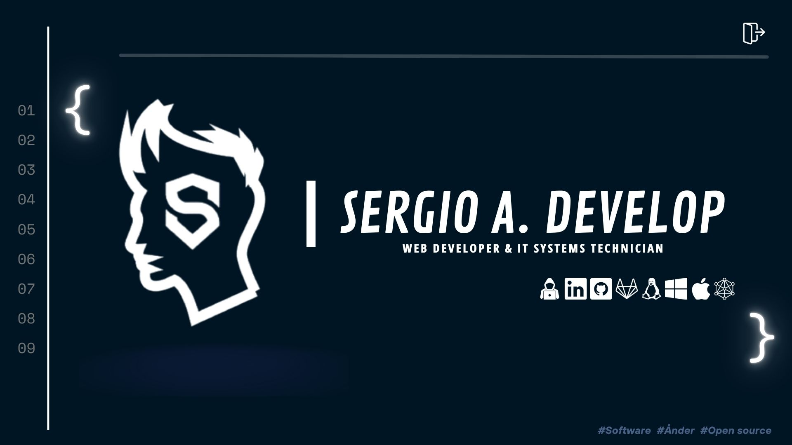

# Hi , I'm Sergio A. Romero </b> 
### A passionate full stack developer!

<h2> About Me</h2>
holaa
I am a Programmer since 2023, with a great passion for technology and problem-solving. My programming repertoire includes languages such as Python, Node.js, Java, and many more, allowing me to tackle a wide variety of development projects.

I have successfully managed projects and resolved complex technical issues in software development. My work and dedication reflect a commitment to organization, dedication, and continuous learning. I aspire to contribute to the GitHub community, helping in any way possible and collaborating on different types of projects to help the community grow!

 
<pre>
- A passionate Self-taught Front-end & Back-end developer.
- Currently learning Web Development by Self.
- I’m currently open for an Intern or a new job opportunity, this is <a href="https://linktr.ee/sergioromero2k">my social media</a>.
</pre>
