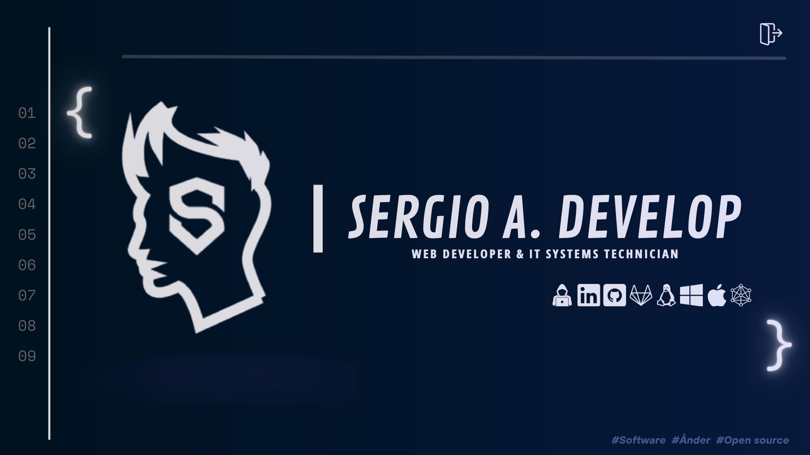

# Hi , I'm Sergio Alejandro! </b> 

### A passionate full stack developer!

<h2>🐼 About Me</h2>

I am a Programmer since 2023, with a great passion for technology and problem-solving. My programming repertoire includes languages such as Python, Node.js, Java, and many more, allowing me to tackle a wide variety of development projects.

I have successfully managed projects and resolved complex technical issues in software development. My work and dedication reflect a commitment to organization, dedication, and continuous learning. I aspire to contribute to the GitHub community, helping in any way possible and collaborating on different types of projects to help the community grow!
 

  
<pre color="black">
- A passionate Self-taught Front-end & Back-end developer.
- Currently learning Web Development by Self.
- I’m currently open for an Intern or a new job opportunity, this is <a href="https://linktr.ee/sergioromero2k">my social media</a>.
</pre>

## <b> Skills</b>

Below, you can find information about the programming languages, technologies, and tools that I am knowledgeable and experienced in throughout my career as a programmer.

### Languages

### Front-End Development:

### Version Controll and Tools:

### System Operations:

### Databases & Extras:

### Cloud Hosting:

## <b> GitHub Analytics

<!-- grph -->

  

    
    
  

  

## <b> Contact </b>

  

<b>Credit: </b> 
<a href="https://github.com/sergioromero2k">Sergio A. Romero</a> 
<b>Last Edited on: </b> 06/12/2025

